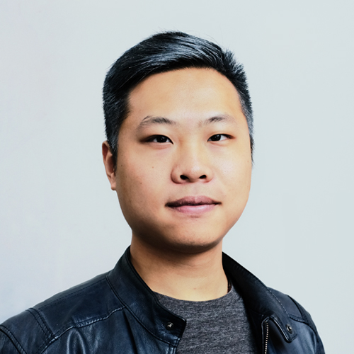

---
# You don't need to edit this file, it's empty on purpose.
# Edit theme's home layout instead if you wanna make some changes
# See: https://jekyllrb.com/docs/themes/#overriding-theme-defaults
layout: index
body_class: home-page

---
<header class="container-fluid text-white">
  

    <h2 class="intro-subtitle align-middle">
      Understanding the Global Food Delivery Ecosystem and Providing Future Focused Solutions
    </h2>
  

</header>

<section id="about" class="container-fluid">
  

    

      

        <h2>About this project</h2>
      

      

        <object type="image/svg+xml" data="assets/pictures/huhtamaki-logo.svg" class="logo logo--huhtamaki"></object>
        <object type="image/svg+xml" data="assets/pictures/aalto-logo.svg" class="logo logo--aalto"></object>
      

    

    

      

        

        Huhtamäki are global specialists in packaging for food and drink, dedicated to making every consumer experience enjoyable, consistent, and safe. They approached Aalto University’s Masters Program in International Design Business Management for this student project to help them solve a business & product related problem.
        

      

    

    

      

        <h3>The team</h3>
      

    

    

      

        

          
          

            <h5 class="card-title">Juho Viironen</h5>
          

         

      

      

        

          
          

            <h5 class="card-title">Varya Stepanova</h5>
          

         

      

      

        

          
          

            <h5 class="card-title">Adithya Varadarajan</h5>
          

         

      

      

        

          
          

            <h5 class="card-title">Jialai Qian</h5>
          

         

      

    

    

      

        <h3>The goal</h3>
        

        Understanding and visualizing the rapidly growing global Food Delivery Ecosystem and providing future focused solutions for how Huhtamaki can become a player in this ecosystem
        

      

    

    

      

        <a class="btn btn-outline-light btn-lg" href="about" role="button">Click for more</a>
      

    

  

</section>

<section id="methodology" class="container-fluid">
  

    

      

        <h2>Methodology</h2>
        

        We understood that a successful solution would need a thorough understanding of the domain and to enable this, our team did extensive research to map out & understand the food delivery ecosystem, the key players, the influencers and the overall trends going forward. We approached this from four different perspectives: food consumer, food delivery platform, food producer and packaging producer. Overall, we followed the process shown below.
        

      

    

    

      

        <object type="image/svg+xml" data="assets/pictures/schemes/process.svg" class="process"></object>
      

    

    

      

        <a class="btn btn-outline-light btn-lg" href="methodology" role="button">Click for more</a>
      

    

  

</section>

<section id="findings" class="container-fluid">
  

    

      

        <h2>Findings</h2>
        
By integrating direct insights from consumers and combining that with key information gleaned from food delivery conferences, restaurant tours, interactions with representatives from delivery companies and even lots of video observations of the delivery process, we were able to craft a comprehensive understanding of the ecosystem. The key outcome of this understanding is presented in the diagram below which features the main industry stakeholders and their interconnections.

        

          TODO: Links to <a href="findings/consumer">consumer findings</a> and <a href="findings/industry">industry findings</a> should be part of text.
        

      

    

    

      

      

      

        <a class="btn btn-outline-light btn-lg" href="findings" role="button">Click for more</a>
      

    

    

      

        <object type="image/svg+xml" data="assets/pictures/schemes/ecosystem.svg" class="ecosystem"></object>
      

    

  

</section>

<section id="concepts"  class="container-fluid">
  

    

      

        <h2>Concepts</h2>
        
This overall understanding of the ecosystem, combined with our insights gathered from the various players, allows us to present this potential roadmap for innovation going forward. We believe packaging alone isn’t enough for Huhtamaki to become a player in this space and thus we have shared a range of situations where they can add value.

        

          <a class="btn btn-outline-light btn-lg" href="concepts" role="button">Click for more</a>
        

      

      

        <object type="image/svg+xml" data="assets/pictures/schemes/solution.svg" class="solution"></object>
      

    

  

</section>
